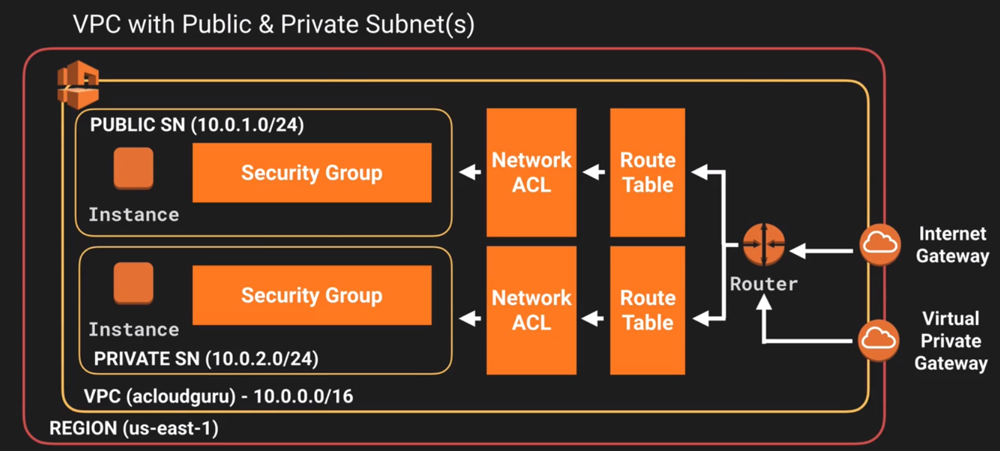

# AWS Certified Solutions Architect Associate

[TOC]

# 10000ft view

Availability Zone: one or more discrete Data Centers; each with redundant power, network

Region: physical locations that contain >=2 AZs

Edge locations: caching content; Amazon CDN

```
n(Region) < n(Availability Zones) < n(Edge Locations)
```

# IAM - Identity Access Management

**users**: end users like employees of an org

**groups**: collection of users. All users of a group inherit the permissions of the group 

**policies**: policy document in json that says what permissions can be applied to users/groups/roles

**roles**: assumed by AWS resources and users to define a set of permissions for making AWS service requests

Identity Federation: Use LDAP, Google, LinkedIn, Facebook, etc. for logins

multi factor auth

can be used to give temporary access to devices

PCI DSS certified: certified to store credit cards information

API access can use Identity Federation and MFA.

**Power users** have full access to all AWS resources minus administration of users and groups.

Users, groups, and policies are universal and not restricted to regions.

https://aws.amazon.com/iam/faqs/

## IAM dashboard

alias for account; let's you use customized logins URLs

Users not locked to any region; always global.

5 ticks to be worked on. One of the important ones to setup MFA on the root account.

Password policies can be customized.

Users credentials can be downloaded to CSV at the time of

- creating the user
- editing password after user is created

***Credential Report* CSV download will not contain the passwords, so save the password CSV files or else you will have to regenerate them.**

User passwords types:

- login password with MFA if enabled (login to web console)

- access key id and secret access key (programmatic access to APIs)


## Create billing alarm

Inside CloudWatch, create alarm to check billing/cost

- ran at every configured period
- static (value as a threshold) or detect anamoly (use a value band as a threshold)
- create SNS (simple notification service) topic
- go to email and subscribe to that topic

# S3

**Object based** storage as against byte modification storage. File size can be **0 bytes to 5 TB**. Unlimited storage. Block based, so can't install OS.

## Bucket

- like a folder
- needs to be universally unique or unique gobally; universal namespace
- URL or web address created for it
- HTTP 200 code received if upload is successful
- by default newly created bucket is private. Access can be setup using:
  - bucket policies (**bucket level**)
  - Access Control Lists (**object level**)
- **Access logs** can be configured to be stored on another bucket in same or different account
- 100 buckets allowed per account
- Restricting bucket access:
  - bucket policies
  - object policies
  - IAM policies to users and groups

## Object

- key: name of the object
- value: content of the object in series of bytes
- version ID: used for version control
- metadata
- subresources: ACL, torrents

MFA delete can be enabled.

## Data consistency

Read after write for PUTs means

- writing new files will be immediately available for reads

"Eventual consistency" for overwrite PUTs and DELETEs means 

- if you overwrite an object and try to read immediately, you may get old version  
- takes a little time to propogate

## Guarantees

99.999..9% (11 x9) durability; Tiered storage; lifecycle management; versioning; encryption; multi factored auth for deletion; access control lists

## Path Styles

- Virtual style puts your bucket name 1st, s3 2nd, and the region 3rd.   

  - ```
    https://bucket-name.s3.Region.amazonaws.com/key-name
    ```

- Path style puts s3 1st and your bucket as a sub domain. Phasing out.

  - ```
    https://s3.Region.amazonaws.com/bucket-name/key-name
    ```

- Legacy Global endpoint has no region. Limited support and discouraged.

- S3 static hosting can be your own domain or your bucket name 1st, s3-website 2nd, followed by the region.

## Storage classes

1. **Standard**

   99.99% availability, 99.x11 9 durability; stored redundantly across multiple devices/facilities; sustain loss of 2 facilities concurrently

2. **Infrequently Accessed**

   99.9% availability; for data accessed infrequently, but need rapid access when needed; lower fee, but retreival fee applicable (previously reduced redundancy storage)

3. **One Zone - Infrequently Accessed**

   99.5% availability; Lower cost than IA; multiple availability zones not needed; 

4. **Intelligent Tiering**

   99.9% availability; Machine Learning used to understand how data is used and moved to that tier automatically

5. **Glacier Instant Retrieval**

   99.9% availability; 68% cheaper than IA **when accessed once per quarter**; retrieval time is in milliseconds

6. **Glacier Flexible Retrieval**

   99.99% availability; Low cost archive, 10% cheaper than Glacier Instant Retrieval; store any amount of data; retrieval time configurable from hours to minutes

7. **Glacier deep archive**

   99.99% availability; lowest cost archive; retrieval time is 12 hours

**See S3 tier comparison chart** https://aws.amazon.com/s3/storage-classes/#Performance_across_the_S3_Storage_Classes

**Read S3 FAQ** https://aws.amazon.com/s3/faqs/

**S3 Outposts** provides a single Amazon S3 storage class to keep data close to on-premises applications; uses S3 APIs; redundantly store data across multiple devices/servers; ideal for workloads with local data residency requirements or demanding performance; transfer data to AWS Region with AWS Data Sync

## Charge criteria

Storage; Requests; storage management pricing; data transfer pricing; 

transfer acceleration: transfer to edge location first then send to S3 bucket via Amazon's backbone network;

cross region replication pricing: replicating buckets across regions for HA or disaster recovery

## lab : Options when creating bucket

name is unique; select region; can clone

versioning maintained on same bucket; access logs; key-value pair tags; object level logging; encryption; cloudwatch metrics

blocking public access

Access to buckets can be setup via:

- bucket policies  (**bucket level**)
- ACLs (**object level**)

## Uploading files

Uploading files gives URL which cannot be used till object is made public

- bucket needs to be made public
- object needs to be made public

Storage class can be specified at object level

## Pricing Tiers

***exam: which tier to use for a scenarios; which is cheaper than the other***

### what are you charged for?

- storage
- requests and data retrievals
- data transfer
- management 
- replication

### comparisons notes

cheaper in order of: 
S3 -> S3 IA -> S3 IT -> S3 One Zone IA -> S3 Glacier -> Glacier deep archive

One Zone IA risks loss of data or unavailability if that one zone goes down.

#### S3 standard and intelligent tiering

same but intelligent tiering gives 

- access to infrequently accessed (IA) which makes IA objects cheaper to store
- management fee per 1000 objects

Better to use Intelligent Tiering than S3 standard unless you have thousands/millions of objects.

## Encryption

### Encryption in transit

transfer from server to client is encrypted

achieved via SSL/TLS

### Encryption at rest

encrypted when stored; done per object; 2 forms

#### Server side

Amazon helps with encryption

Services

- S3 managed keys using AES-256 (SSE-S3)
- AWS Key Mgmt Service (SSE-KMS)
- with customer provided keys (SSE-C)

##### lab :

*click on object* > Encryption > *options to use SSE-S3 or SSE-KMS*

#### Client side

client encrypts files before uploading

## Versioning

stores all versions to restore even if deleted; 

each object version maintained with permissions, storage tiers;

used for backup;

once enabled cannot be disabled, only suspended;

lifecycle rules;

delete via MFA;

### lab :

*select bucket* > Properties > Versioning > *enable or suspend*


Upload a file to this bucket; make object public; it can be accessed via URL.

URL will be with `versionId` query param. Example, `https://<bucket_url>/fileName.txt?versionId=abcversionid123`

Upload file with same name and extension to the bucket; the object is replaced; **but new version of object is no longer public**; need to make it public again to be accesible via URL; **older version will still be public**


In Bucket view, toggle Versions. You can see different versions of the same object with different version ids. 

Note that the size used by that bucket is now cumulative size of both versions of the same file. **Versioning will use up full size of each revision unlike git where only difference is saved.**


Delete file; the bucket looks empty; toggle on version and you **can see the object and its versions but with a delete marker**

## lab : Lifecycle and Glacier

*bucket view* > Management > Lifecycle

**rule name**: name of the rule 

**rule scope**: filter the objects that this rule applies to or all objects

**lifecycle rule actions**: what to do, to what version of object, at what interval; transition between states, delete, etc.

Timeline summary is displayed as describing what happens to applicable objects as time passes.

- Automates moving your objects between different storage classes.
- can be used in conjuction with versioning.
- can be applied to current and previous versions.

## Object lock and Glacier Vault Lock

Uses WORM (write once, read many) model where you can lock modification/deletion of the object for finite time or indefinitely.

Locks can be applied on individual objects or entire buckets.

### Modes

- governance: users with right/permissions can modify object
- compliance: object can't be modified for the retention period by even the root user; retention period cannot be shortened

**Retention period** is applied by storing a timestamp on the object's metadata.

**Legal holds** do not require retention period and object is blocked from modification till legal hold exists. It can be applied by users with legal hold permission.

Vault lock policies can be applied on Glacier vaults which once applied cannot be changed.

## S3 Performance

**Prefix** is path between bucket name and object name.

S3 has extremely low latency.

PUT/COPY/POST/DELETE at **3500 requests** per second per prefix

GET/HEAD at **5500 requests** per second per prefix

**If you spread out your object in separate prefixes, you can get that much high read rate.**

If you use **SSE-KMS**, then 

- read will need decrypt and writes will need encrypt. 
- This puts a limit on the objects that use SSE-KMS which is the KMS quota. 
- This KMS quota depends on regions and cannot be increased.

**Multipart uploads** parallelize uploads:

- recommended for files > 100MB
- required for files > 5GB
- application will have to handle splitting of the file before multipart uploads

**Byte range fetches** are download equivalents of above:

- parallelize downloads
- failure is only for that byte range
- used to download partial amount of the file

## S3 and Glacier Select

**S3 Select**: Achieve drastic performance increase by using simple SQL expressions to fetch subset of data from object. Save money on data transfer.

**Glacier Select**: Same as above but on Glacier. Used for customer that need storage compliance.

## AWS Organizations and Consolidated Billing

Multiple AWS accounts can be consolidated into an **AWS organization**. Access to services can be given to orgs which will trickle down to accounts.

**Consolidated billing** allows easy tracking of charges, allocating costs. Volume pricing discount applicable.

Go to Services > AWS Organizations
create organizations; add accounts by sending invites;

**Root account**: always enable multi factor authentication; strong, complex passwords

**Paying account**: use for billing only; no resources deployed here

**Service Control Policies** (SCP) can be used to control access to services on OU or individual accounts. 

## lab: Sharing S3 between accounts

3 ways to share buckets between accounts:

- Programmatic access
  - Bucket policies and IAM (across entire bucket)
  - ACLs and IAM (individual objects)
- Programmatic and Console access
  - Cross account IAM Roles 


Create Role > grant permissions > give Role name > copy and save link 

Log into other account > Account drop down > Switch Role OR use link to open page that has Role information already filled in

## lab: Cross Region Replication

create a new bucket B > enable versioning

go to original bucket A > go to needed version > Create Replication Rule > IAM role > select Source bucket A (limit scope or entire bucket)  > Destination bucket B

Few configurations:

- Storage class for replicated objects
- Replication Time Control (replicate 99.99% objects in **15 minutes**)
- metrics and events
- encrypt with KMS
- replicate delete markers (deletion operations are replicated, lifecycle rules do not apply)

Replication only starts working when Replication Rule is turned on. Existing files, if any, are not replicated.

Permissions in source bucket and destination bucket are separate.

Versioning should be enabled on both source and destination buckets.

Deleting individual versions or delete markers are not replicated.

## Transfer Accelaration

- Uses CloudFront Edge Network
- Upload to Edge location (instead of directly to S3 bucket). Edge location transfers to S3 bucket.

S3 Tranfer accelaration tool to test giving comparison of upload speeds when done via various Edge location against direct S3 upload.

## AWS DataSync

- move large amount of data from **on-prem to AWS**
- NFS or SMB compatible
- hourly, daily, weekly
- DataSync agent needs to be installed
- replicate EFS to another EFS

## CloudFront

- CDN (content delivery network)
- distributed servers
- deliver webpages and other web content
- optimizes based on 
  - geographic location of user
  - origin of webpage
  - content delivery server

**Edge location**: where content is cache; separate to an AWS region

**Origin**: S3 bucket, EC2 instance, Elastic load balancer, Route53

**Distribution**: CDN which is a collection of edge locations

User's request is routed to nearest edge location. Content is cached at edge location till time-to-live.

Distribution types:

- web distribution: websites
- RTMP: media streaming

Read and write(Transfer Accelaration) on edge locations.

Cache can be cleared but you will be charged.

## lab: create a CloudFront distribution

Networking > CloudFront > create distribution > Web or RTMP

origin domain name; path; origin id; TTL (min, max); signed URLs/cookies only(for users that have paid for content); WAF

Can take 15 mins - 1h 

Deleting a distribition will need disabling first

Distributions come with their own domain name. Use that domain name to access your S3 content.

Invalidations can be created to remove objects from the Edge caches.

## Signed URLS and Cookies

Used to secure content by giving access to only authorized users, commonly those that have paid for the content.

When 1 file, use signed URL. When multiple files, use cookies.

### Policy 

contains:

- URL expiration
- IP ranges
- Trusted signed (which aws accounts can create signed urls)

### Flow

- Client authenticates with application
- application returns signed URL to client
- client uses signed URL to access content from CloudFront
- Cloudfront uses OAI to fetch from S3

### CloudFront signed URLs 

- can have different origins, not just EC2 or S3
- key-pair is account wide; managed by root user
- caching
- filter by date, path, IP, expiration, etc.

### S3 signed URLs

- issue request as IAM user who has presigned it; all permissions as that IAM user
- limited lifetime

*If user doesn't have direct access to S3, S3 signed URL cannot be used. Use CloudFront signed URLs instead.*

## Snowball

Physically transfer files to S3. Import or export.

Snowball has 50 or 80 TB

Snowball Edge has 100TB; gives compute capabilities as well

Snowmobile has 100PB capacity

Consider using these capabilities according to your network speeds to upload/download from S3.

## Storage Gateway

Used to **connect on-premise software appliances to cloud storage**.

Can be a virtual machine image or a physical appliance.

**File gateway (NFS and SMB)**: store files to S3; allows all features of S3 onto the stored files/objects; 

**Volume gateway (iSCSI)**: store images of harddisks on S3; incremental changes are stored for versioning; uses Amazon EBS snapshots

- stored: store primary data locally; asynchronously back up to S3 in form of EBS

- cached: S3 as primary data storage; retain frequently accessed data locally in storage gateway

**Tape gateway**: store tapes in virtual tapes and move to cloud; archive data; VTL interface

Connects over Direct Connect.

## Athena vs Macie

### Athena

- interactive query service using which you can analyse and query data on S3 using standard SQL
- serverless; pay per query OR per TB scanned
- no ETL setup
- can be use on log files, business reports, AWS cost and usage reports, click-stream data

### Macie

- Personally Identifiable Information (PII) eg home address, email addres, SSN, phone number, etc
- uses ML and NLP to discover, classify, protect PII
- works on data on S3
- analyze CloudTrail logs
- gives dashboards, alerts, reports
- PCI-DSS compliance; prevent ID theft

# EC2

- resizable compute capability in the cloud
- upscale and downscale capability as needed
- Amazon Elastic Compute Cloud

Amazon Elastic Compute Cloud (EC2) will begin rolling out a change to restrict email traffic over port 25 by default to protect customers and other recipients from spam and email abuse. 

### Models

#### On demand

fixed rate by the hour/second; trying things out; no long term commitments

Amazon EC2 is transitioning On-Demand Instance limits from the **current instance count-based limits to the new vCPU-based limits** to simplify the limit management experience for AWS customers. Usage toward the vCPU-based limit is measured in terms of number of vCPUs (virtual central processing units) for the Amazon EC2 Instance Types to launch any combination of instance types that meet your application needs.

#### Reserved

capacity reservation; significant discount on hourly charge; 1 or 3 years terms

Depending on you type of RL you can You can modify the AZ, scope,  network platform, or instance size (within the same instance type), but  not Region.

**Standard**: 75% off

**Convertible**: 54%; change instance type

**Scheduled**: time window when capacity will be used

#### Spot

bid whatever prices you want for instance capacity

when the price goes above your bid, the applications are taken down. If EC2 takes the application down, you will not be charged for that partial hour used. But if you take it down, you will be charged an hour.

usefully for when applications are flexible and feasible only at very low costs

#### Dedicated hosts

dedicated **physical** EC2 servers for your use

no multiple tenancy

can be purchased on hourly basis

existing software licenses that restrict deployment on limited number of servers

### Instance Types

Multiple EC2 Instance types as per your needs. 

**Accelerated Computing instance** family is a family of instances which use hardware accelerators, or co-processors, to perform some functions,  such as floating-point number calculation and graphics processing, more  efficiently than is possible in software running on CPUs.

**GPU instances** work best for applications with massive parallelism such as workloads using thousands of threads. 

**Compute Optimized instances** are designed for applications that benefit  from high compute power. These applications include compute-intensive  applications like high-performance web servers, high-performance  computing (HPC), scientific modelling, distributed analytics and machine learning inference.

Amazon EC2 **Mac instances** are a family that features the macOS operating system, powered by Apple Mac mini hardware, and built on the AWS Nitro System.

Amazon EC2 **A1 instances** are general purpose instances powered by the  first-generation AWS Graviton Processors that are custom designed by  AWS.

Amazon EC2 allows you to choose between **Fixed Performance Instances** (e.g. C, M and R instance families) and **Burstable Performance Instances** (e.g. T2). Burstable Performance Instances provide a baseline level of CPU performance with the ability to burst above the baseline if they have accumulated enough CPU credit by staying idle (CPU credits are consumed by when instances are active).

Amazon EC2 **High Memory instances** offer 3, 6, 9, 12, 18, or 24 TiB of memory in a single instance. Offered as both virtualized and bare metal. They use Elastic Network Adapter (ENA) for high speed connectivity.

**Memory-optimized instances** offer large memory size for memory intensive  applications including in-memory applications, in-memory databases, in-memory analytics solutions, High Performance Computing (HPC), scientific computing, and other memory-intensive applications. 

**Dense-storage instances** are designed for workloads that require high sequential read and write access to very large data sets, such as Hadoop distributed computing, massively parallel processing data warehousing, and log processing applications.

**High I/O instances** use NVMe based local instance storage to deliver very high, low latency, I/O capacity to applications, and are optimized for applications that require millions of IOPS. Like Cluster instances, High I/O instances can be clustered via cluster placement groups for low  latency networking. Used when random memory IO is needed.

FIGHTDRMCPXZAU

For example, 

- T3 is lower cost and general purpose for web servers and small DBs; 
- M5 is for general purpose Application servers.

## lab: Setting up EC2

#### Storage
Root volume will be SSD and magnetic. Subsequent volumes can be of more types.
IPOS: input output per second can be configurable
Delete on terminate or not, EBS root volume is deleted by default
Encrypt or not

#### Termination

Configure what happens when you terminate: stop or terminate
Termination Protection (default off) doesn't allow the usual terminate button to work. Will have to disable termination protection to actually terminate.

#### Other

Tags
Security Groups: what protocol, at what port, and what IP
Key pair is created
Console can be access via web-based in browser console, EC2 Instance Connect


Connecting via console: 

```
ssh ec2-username@IPADDRESS_EC2 -i PrivateKey.pem
```

## Security Groups

Virtual firewalls that control traffic to EC2 instance.

Changes to security group are reflected immediately.

All inbound traffic is blocked by default, all outbound is allowed.

Therefore, only allow rules can be configured, no support for deny rules.

Define which type of connection (eg. HTTP, SSH, etc) , which protocol (eg. TCP), which port (eg. 80, 22) is allowed inbound and outbound on the instance.

**If inbound is created for a port, the outbound is created automatically. Stateful.**

1 Security Group can have many EC2 instances. 1 EC2 instance can have many Security Groups.

No way to blacklist. Only whitelist.

#### Instead

Specific IP addresses cannot be blocked using Security Groups. Use NACL instead.

Traffice cannot be controlled by what is in request. Use WAF instead.

## EBS 101 

The data stored on a **local instance store will persist only as long as that instance is alive**. However, data that is stored on an Amazon EBS volume will persist independently of the life of the instance. 

Normally, EBS volumes can only be attached to one EC2 instance. As of Feb 2020 you can attach certain types of EBS volumes to multiple EC2 instances. https://aws.amazon.com/blogs/aws/new-multi-attach-for-provisioned-iops-io1-amazon-ebs-volumes/

Elastic Block Storage is a hard-disk on the cloud.

Migrating or encrypting non-encrypted EBS volumes will need them to be converted to AMI before they can be re-launched.

EBS volumes can be detached while instance is running only if the volume is not the root volume of that EC2 instance.

You can add multiple volumes to an EC2 instance and then create your own RAID 5/RAID 10/RAID 0 configurations using those volumes.

You can control whether an EBS root volume is deleted when its  associated instance is terminated. The default delete-on-termination  behaviour depends on whether the volume is a root volume, or an  additional volume. By default, the DeleteOnTermination attribute for  root volumes is set to 'true.' However, this attribute may be changed at launch by using either the AWS Console or the command line. For an  instance that is already running, the DeleteOnTermination attribute must be changed using the CLI.

### General Purpose (SSD) - gp2

Most workloads; **gp2** API; <=16K IOPS

### Provisional IOPS (SSD) - io1

Databases; **io1** API; <=64K IOPS

### Throughput Optimised HDD - st1

Big data, warehouses; **st1** API; <=500 IOPS

### Cold HDD - sc1

File servers; **sc1** API; <=250 IOPS

### Magnetic - standard

infrequently accessed data; **Standard** API; 40-200 IOPS

Use SSDs for fast random access; expensive. 

Use HDD for sequential access, cheaper.

## lab: EBS Volumes

Volume will be in the same AZ as the EC2 instance.

Volume sizes can be changed, but will take time to reflect. May need to re-partition the drive to detect the added size.

Hardware assisted virtualization

Snapshots are point in time copies of Volumes. **Incremental** nature i.e. only changes are stored on S3. First snapshot takes time to create.

### Migrating EBS overview 

1. Volumes to snapshots
2. snapshots to AMI (Amazon Machine Image) 
3. copy AMI to destination region 
4. launch on another AZ

For root device (device with OS) snapshots, best pratice to stop the instance before taking snapshot.

## AMI types

### Selection criteria

- region

- OS

- arch (32/64-bit)

- launch permission

- storage for root device

  - Types and criteria

  | criteria                                                     | instance store (ephemeral) | EBS Backed        |
  | ------------------------------------------------------------ | -------------------------- | ----------------- |
  | what happens to data after restart due to host failure?      | deleted                    | not deleted       |
  | can it be stopped?                                           | no                         | yes               |
  | can be configured to not delete after termination on instance? | no                         | yes               |
  | can be rebooted?                                             | yes, no data loss          | yes, no data loss |


## Networking

By default, all accounts are limited to 5 **public** Elastic IP addresses per region. 

A small hourly fee is charged when your EC2 instance that uses a public IP is not running.

You do not need an Elastic IP address for all your instances. By default, every instance comes with a private IP address and an internet routable public IP address. The private IP address remains associated with the  network interface when the instance is stopped and restarted, and is  released when the instance is terminated. The public address is  associated exclusively with the instance until it is stopped, terminated or replaced with an Elastic IP address. These IP addresses should be  adequate for many applications where you do not need a long lived  internet routable end point. 

### ENI vs ENA vs EFA

| criteria | ENI                                             | ENA                                                          | EFA                                                          |
| -------- | ----------------------------------------------- | ------------------------------------------------------------ | ------------------------------------------------------------ |
| meaning  | Elastic **Network Interface**                   | **Enhanced networking** via Elastic **Network Adaptor** (100 Gbps) or Virtual Function (10 Gbps) | Elastic **Fabric Adaptor**                                   |
| use case | basic networking; low budget; multiple networks | reliable, high throughput                                    | high-performance computing, ML applications, OS by pass (linux only) |

## lab: Encrypted root device volumes and snapshots

When creating root volumes, you have the new option to configure encryption at creation time.

For encrypting existing volumes that are without encryption,

- create snapshot
- create copy, mention that it needs to be encrypted
- create AMI 
- use AMI to launch instance

Cannot take an encrypted snapshot and launch as unencrypted

Snapshots can be shared only when unencrypted.

You should enable **Fast Snapshot Restore** on snapshots if you are concerned about latency of data access when you restore data from a snapshot to a volume and want to avoid the initial performance hit during initialization. Will improve only snapshot restore and not snapshot creation.

Snapshot of an EBS Volume that is used as the root device of a registered AMI cannot be deleted.

## Spot Instances and Spot Fleets

AWS has unused capacity. This capacity can be bid on. If price matches below your maximum bid, the capacity is provisioned for your use. When the spot prices goes above your bid, your application is brought down.

Used when you need flexible, fault tolerant applications that can be brought down in 2 minutes notice and resume when brought up again -applications that need not be online all the time.

Use only when **ephemeral storage** is needed.

Can **save upto 90%** cost of On-Demand instances.

**Spot blocks** can be used to **stop termination for 1 to 6 hours** if spot price goes above your bid.

### Spot request

- maximum price
- desired number of instances
- launch specs
- request type (if application went down due to spot price increase, what to do next time that spot price goes below bid?) :
  - one time: do nothing
  - persistent: bring application up again
- valid from and until

### Spot Fleets

Collection of Spot instances and (optionally) On-Demand instances

Will try to maintain target capacity within budget

## EC2 Hibernate

**What happens when EC2 instance starts**: OS boots up, User data scripts are run, application starts

**What happens on Hibernation**: saves contents of instance RAM into EBS root volume in encrypted form; persists root and data volumes; on restart RAM contents are reloaded, processes are resumed, OS need not restart; **instance ID is retained**; Elastic IP address is retained

Root volumes need to be encrypted to use hibernate.

Use cases for hibernate: long running processes; applications that take time to initialise 

RAM must be <150GB

Hibernation time cannot exceed 60 days

Available for On-Demand and Reserved instances

In the case of hibernate, your instance gets hibernated and the RAM data persisted. In the case of Stop, your instance gets shutdown and RAM is cleared. Hibernated instances are in ‘Stopped’ state.

## CloudWatch

**Monitoring performance** of:

- Compute:
  - EC2 instances
  - autoscaling groups
  - Elastic load balancers
  - route53
- Storage
  - EBS
  - Storage gateways
  - CloudFront

EC2 is 5 minutes by default (standard), configurable to 1 minute intervals (detailed).

CloudWatch alarms can be created to trigger notifications.

Events help to respond to state changes.

Logs help with aggregate, monitor, and store logs.

Host level metrics like CPU, Network, Disk, status check

### CloudTrail (Auditing)

User and resource activity monitored by **recording AWS management** console actions and API calls. Unrelated to CloudWatch.

## lab: CloudWatch

Dashboards, Alarms, Events, Logs

## lab: AWS Command Line

Needs programmatic access in IAM

ssh to EC2 instance then use the aws command

```
> aws configure
-- to configure keys

> aws s3 ls
-- <aws command> <service> <command>
```

`.aws` folder contains credentials file. Best practice not to use configure and store in credentials file. See *IAM Roles*.

## lab: IAM Roles

On individual EC2 instances, **Roles are more secure** **and easy to manage** than string access keys and secret access keys .

Roles can be assigned to EC2 instance using both command line and console.

Roles are universal.

Permissions of a role can be changed, even if that role is already assigned to an existing EC2 instance. Changes will take effect immediately.

AWS Console can be used to add a role to an EC2 instance after that instance has been created and powered-up.

## lab: Using Boot Strap Scripts

Configure instance details > Advanced Details > user data

```bash
#!/bin/bash
yum update -y
yum install httpd -y
service httpd start
chkconfig httpd on
cd /var/www/html
echo "Jai mata di" > index.html
aws s3 mb s3://<domain>
aws s3 cp index.html s3://<domain>
```

## EC2 Instance Metadata

 ```bash
curl http://<169.254.169.254>/latest/meta-data
curl http://<169.254.169.254>/latest/user-data
 ```

## lab: Elastic File System

Supports NFSv4

**Multiple EC2 instances cannot share an EBS volume** but can share a EFS volume. As of Feb 2020 you can attach certain types of EBS volumes to multiple EC2 instances. https://aws.amazon.com/blogs/aws/new-multi-attach-for-provisioned-iops-io1-amazon-ebs-volumes/

Grows and reduces automatically, no pre-provision of space needed. Pay for only what you use.

Supports thousands of concurrent NFS connections.

Data stored across multiple AZs within a region.

Read after write consistency.

Use when Linux is needed.

## FSX for Windows and FSX for Lustre

FSX for Windows: Windows file server designed for Windows based applications. SMB based which is Windows proprietary.

FSX for Lustre: for HPC (high performance compute) and ML applications. Can stored data directly on S3.

## EC2 Placement Groups

How to place or group EC2 instances?

**Cluster Placement group** is grouping of instances within a single AZ. Applications that need low latency, high n/w thruput. EC2 **very close to each other**. AWS recommends grouping same instance types in cluster placement group.

**Spread Placement Group** are group of instances each placed on **distinct underlying hardware**. Used when you have small number of **critical instances that should be kept separate** from each other. Can be spread across multiple AZs. Maximum of 7 running instances per Availability Zone

**Partitioned Placement groups** divides each **group into logical segment partitions** such that each partition that its **own rack** (each rack has own network and power source). Used for HDFS, HBase, Cassandra. Can be spread across multiple AZs.

Groups cannot be merged.

Instances must be stopped before moved into different groups.

## HPC (high performance compute) on AWS

### Data Transfer

Snowball, AWS Data Sync, Direct connect

AWS Direct Connect is a dedicated line between from your premises to AWS rather than using Internet.

### Compute and Network

EC2 instances that are GPU or CPU optimised; EC2 fleets; Cluster Placement groups; ENA, ENI, EFA

### Storage

Instance attached: EBS, Instance store

Network storage: S3, EFS, FSx for Lustre

### Orchestration and Automation

AWS batch; AWS ParallelCluster

## AWS WAF

**Web Application Firewall** to **monitor HTTP and HTTPS requests** that are forwarded to 

- CloudFront
- Application Load Balancer
- API gateway.

Works on Level 7

Control access to content.

Firewall on what IP addresses should be allowed or what query parameters should be passed.

Actions available: Allow, Deny, Count.

### Conditions to check in request

- IP addresses
- Country of origin
- values in request header
- strings or regex matches
- length of request
- presence of SQL code
- presence of malicious scripts

### Instead

For IP and port level, use Security Groups instead.

For IP and port level deny, use NACLs instead.

# Databases on AWS

**Multi-AZ** for disaster recovery. Auto fail over.

**Read replicas** for performance. No auto scaling or fail over.

**RDS (OLTP)**

- Microsoft SQL Server
- Oracle
- MySQL Server
- PostgreSQL
- Amazon Aurora 
- MariaDB

**No SQL**

- DynamoDB 

**Data Warehousing (OLAP)**

- Red Shift

**In-memory caching or Elasticache**

- MemcacheD
- Redis

A **database parameter group (DB Parameter Group)** acts as a “container”  for engine configuration values that can be applied to one or more DB  Instances. If you create a DB Instance without specifying a DB Parameter Group, a default DB Parameter Group is used. This default group  contains engine defaults and Amazon RDS system defaults optimized for  the DB Instance you are running. 

**Enhanced Monitoring for Amazon RDS** gives you deeper visibility into the health of your Amazon RDS instances. Captures instance system level metrics, such as the CPU, memory, file system, and disk I/O among others.

**Amazon RDS Proxy** is a fully managed, highly available, database proxy feature of Amazon RDS that enables your applications to: 

1. improve **scalability** by pooling and sharing database connections; 
2. improve **availability** by reducing database failover times by up to 66% and preserving application connections during failovers; 
3. improve **security** by optionally enforcing AWS IAM authentication to databases and securely storing credentials in AWS Secrets Manager.

If you want your application to check RDS for an error, have it look for an ERROR node in the response from the Amazon RDS API.

MySQL installaton port is 3306.

## Lab: create RDS instance

Configure your DB Security Group to talk with application's Security Group when creating the RDS instance.

RDS instances 

- run on virtual machines
- cannot ssh into OS
- patching is Amazon's responsibility
- cannot be serverless (except Aurora)

## Back Ups, Multi-AZ, and read replicas

2 types of backup, **both stored in S3**:

- automated backups
- database snapshots

When these backups are restored, the RDS instance will be a new one with a new DNS endpoint.

Encryption is managed using Amazon KMS. Encryption at rest. When encryption is enabled on RDS instance automated backups, snapshots, read replicas are encrypted.

On a single-AZ RDS instance setup, I/O may be briefly suspended while the backup process initializes (typically under a few seconds), and you may experience a brief period of elevated latency.

It is normal to have **1 or 2 more automated DB snapshots than the number of days in your retention period**. One extra automated snapshot is retained to ensure the ability to perform a point in time restore to any time during the retention period.

**No transfer charge is incurred** when replicating data from your primary RDS instance to your secondary RDS instance.

If you are using Amazon RDS Provisioned IOPS storage with a Microsoft SQL Server database engine, 16 TB is the maximum size RDS volume you can have by default.

In RDS, changes to the backup window take effect immediately.

### Automated Backups

- performs automatic daily full snapshots with transaction logs
- stored on S3
- retention period is 1 to 35 days
- transaction logs are saved which allows point-in-time recovery down to seconds
- affects IO, so can experience elavated latency
- deleted when RDS instance is deleted
- default on with default 7 day retention period

### Database Snapshots

- not automatic, taken manually
- retained even if RDS instance is deleted. Gives you option to create a new db snapshot on deletion.

### Multi-AZ

- for disaster recovery only
- exact working copy of your RDS instance is synced by AWS **on another AZ but in same region**
- replication used by Multi-AZ deployments is **synchronous**, meaning that all database writes are concurrent on the primary and standby
- fail over is automatic in case of AZ failure or maintenance
- you can force failover from one AZ to another by rebooting RDS instance
- Available for Oracle, SQL Server, MySQL, PostgreSQL, MariaDB. **Not needed for Aurora** since it is fault tolerant by design.
- if you are running a Multi-AZ deployment, **automated backups and DB Snapshots are simply taken from the standby** to avoid I/O suspension on the primary.

### Read Replicas

- for performance improvement during reading
- write is performed to single database, but reads happen from different replicas
- **asynchronous** replication, database writes occur on a read replica after  they have already occurred on the source DB instance, and this replication “lag” can vary
- Read replicas on read replicas are possible. Too many can bring latency.

- can be spread across AZs and regions
- MySQL, PostgreSQL, MariaDB, Oracle, Aurora. **Not for SQL Server.**
- Can be promoted to be their own database. This will break replication.
- automated backups need to be enabled
- upto 5 read replicas available
- each read replica has its own DNS endpoint
- A read replica is billed as a standard DB Instance and at the same rates.

Read replicas are designed to serve read traffic. However, there may be use cases where advanced users wish to execute DDL SQL statements against a read replica. Eg adding a database index to a read replica that is used for business reporting without adding the same index to the corresponding source DB instance.

### Billing

Billing can be on-demand or reserved.

#### Reserved instances

- paid for 1 to 3 years which gives higher discount than on-demand
- on-demand can be converted to reserved instances
- non-refundable
- once term ends, revert back to on-demand pricing
- purchased and can be reserved **only in a specific region**
- read replicas can be reserved instances

## DynamoDB

- No-SQL solution; supports both **documents and key-value** data models

- uses SSDs, single-digit millisecond latency
- spread across 3 distinct geographic locations
- Choose between consistency strategies:
  - **eventually consistent reads**: default option; consistency across all copies reached within 1 second; might not return recently successful write
  - **strongly consistent reads**: returns result that reflects all writes that received successful response prior to read; sub 1 second
  - **ACID** transactions: atomicity, consistency, isolation, and durability 
- DynamoDB **Standard-IA** helps you reduce your DynamoDB total costs for tables that store infrequently accessed data such as applications’ logs, old social media posts, e-commerce order history, and past gaming achievements. 

## Advanced DynamoDB

### DynamoDb Accelarator (DAX)

in-mem cache; 10x performance; microseconds response; no need for devs to manage separate caching logic like memcache or redis

### Transactions

Multiple **"all or nothing" operations** like in financial transactions or fulfilling orders

2 underlying reads/writes: prepare and commit

upto 25 items or 4MB of data

### On-Demand Capacity

**pay-per-request** pricing to balance cost and performance

no minimum capacity

**use for new product launches, then observe and switch to provisioned according to what you learned with on-demand**

### On-Demand backup and Restore

Full backups at any time

Zero impact on table performance and availability

consistent within seconds, retained until deleted

same region as source table

### Point-in-time Recovery

protects against accidental writes or deletes

restore to any point in the **last 35 days to 5 minutes**

incremental backups

not enabled by default

### Streams

time-ordered **sequence** of item-level **changes** in a table

inserts, updated, deletes

stored for 24 hours

stream records grouped into **shards**

combine with lambda functions for functionality like stored procedures

### Global Tables

globally distributed applications

multi region redundancy for DR or HA

no application rewrites

replication latency under 1 second

needs streams enabled

### Database migration service (DMS)

Source and destination DBs can be on prem or on AWS (EC2 or RDS)

### Security

KMS used for encryption

site-to-site VPN, Direct Connect

IAM policies and Roles

Fine-grained access thru IAM to give access to only specific attributes

CloudWatch and CloudTrail

VPC endpoints

## Redshift

petabyte scale data warehouse service

single node config (160Gb)

Multi-node configuration

- **leader** node: manage client requests
- **compute** nodes: store data and perform queries and computations

Individual columns are compressed

Massively parallel processing

Backups:

- enabled by default
- default 1 day retention, maximum retention of 35 days
- maintains at least 3 copies of data
- async replicate your snapshots to S3 in another region

Pricing:

- compute node hours: 1 unit per node per hour; leader node is not charged
- backup
- data transfer

Security

- ssl in transit
- aes-256 encryption at rest
- KMS

Only available in 1 AZ currently

## Aurora

MySQL and PostgreSQL compatible RDS engine

Starts at 10GB, scales in 10GB increaments, upto 64TB

compute resources upto 32vCPUs and 244GB RAM

2 copies of data in each AZ with minimum 3 AZs; so 6 copies of data

share snapshots with other AWS accounts

Types of Aurora replicas:

- aurora read replicas (15); automated failover available with these
- MySQL read replicas (5)
- PostgreSQL (1)

Automated backups on by default

**Serverless** design; comes up, goes down, scales out when required automatically

**Amazon Aurora Global Database** is a feature that allows a single Amazon Aurora database to span multiple AWS regions. No automatic failover. Upto 5 regions.

Amazon Aurora **Parallel Query** refers to the ability to push down and distribute the computational load of a single query across thousands of CPUs in Aurora’s storage layer. Without Parallel Query, a query issued against an Amazon Aurora database would be executed wholly within one instance of the database cluster; this would be similar to how most databases operate. Not to be turned on always as it may incur hogher IO cost.

**Cost effective solution** because:

- serverless saves cost to adjust or bring down instances with inactivity
  - Suited for infrequent, intermittent, or unpredictable workloads
- based on open source
- implemented like other commercial databases

## Elasticache

web service to deploy, operate, and scale in-memory cache in the cloud

Amazon ElastiCache manages the work involved:

- in **setting up** a distributed in-memory environment, from provisioning the server resources you request to installing the software. 
- automating common **administrative tasks** such as failure detection and recovery, and software patching.
- in **detailed monitoring** metrics associated with your nodes, enabling you to diagnose and react to issues very quickly. 

Supports following engines:

- **Memcached**: 
  - simple, multithreaded performance
  - multi-AZ available

- **Redis**: 
  - advanced data types
  - sorting
  - querying
  - persistence
  - multi-AZ and allows back-ups and restores

A **node** is the smallest building block, a fixed-size chunk of secure, network-attached RAM. A Redis **shard** is a subset of the cluster’s keyspace, that can include a primary node and zero or more read-replicas. The shards add up to form a **cluster**.

**Pricing** is per Node-hour consumed for each Node Type.

**Reserved Nodes/Instance (RI)** is an offering that provides you with a significant discount over on-demand usage when you commit to a one-year or three-year term. Cost saved with upfront one time payment.

A **Parameter Group** acts as a "container" for engine configuration values that can be applied to one or more clusters. If you create a cluster without specifying a Parameter Group, a default Parameter Group is used. This default group contains engine defaults and Amazon ElastiCache system defaults optimized for the cluster you are running.

**Auto Discovery** is a feature that saves developers time and effort, while reducing complexity of their applications. Auto Discovery enables automatic discovery of cache nodes by clients when they are added to or removed from an Amazon ElastiCache cluster. Until now to handle cluster membership changes, developers must update the list of cache node endpoints manually which may need restarts.

## Database Migration Service

**Homogenous** (eg Oracle to Oracle) or **Heterogenous** (eg. Oracle to Aurora) migration

Heterogenous needs **Schema Conversion Tool**

EC2 instance that run DMS and SCT. SCT is not needed with homogeneous migrations.

DMS traditionally moves **smaller relational workloads** (<10 TB) and MongoDB, whereas SCT is primarily used to migrate **large data warehouse workloads**. DMS supports **ongoing replication** to keep the target in sync with the source; SCT does not.

## Caching strategies

Services that have caching capabilites:

- CloudFront: media files
- API Gateway
- Elasticache
- DynamoDB Accelarator

Add caching more towards the front to decrease latency.

## Elastic Map Reduce

Cloud big data platform for data processing, interactive analysis, and machine learning using open source frameworks such as Apache Spark, Apache Hive, and Presto

Cluster components:

- **Master** node: **manage and track** status of tasks; monitor health of cluster; at least one in each cluster
- **core** node: runs tasks and stores data on Hadoop Distributed File System
- **task** node: **only runs tasks** and does not store data; optional

Master node stores log data. 

Replication can be configured to replicate log data every 5 mintues on S3; can only be set up during initial creation.

# Advanced IAM

## AWS Directory Service

AWS Directory service is used to regulate access to AWS resources using already existing on-prem AD services.

What are **Active Directories**:

- on-prem directory service by Microsoft
- hierarchical database of users, groups, computers; trees, forests
- apply groups and policies to manager users
- based on LDAP and DNS protocols 
- supports LDAP, NTLM, Kerberos Authentication

**AD Trust** is used to extend AWS AD onto your on-prem.

### **AD compatible Directory Services**

- **Simple AD**

  -  small (<=500) and large (<=5000) user sets 

  -  does not support trusts

- **AWS Managed Microsoft AD**

-  **AD Connector**
   -  Directory gateway (proxy) for on-prem AD
   -  avoid caching information in the cloud
   -  allow on-prem users to log into AWS using AD
   -  scale across multiple AD connectors


### Non AD compatible Directory Services

- **Cloud Directory**
  - directory based store intended for developers
  - multiple hierarchies, millions of objects
  - use cases: org charts, course catalogs, device registries
  - fully managed service

- **Amazon Cognito User Pools**
  - managed user directory for SaaS
  - Sign up/in for web or mobile
  - works with social media


## ARN

ARN `arn:partition:service:region:account_id`

## IAM policies

**IAM policies**

- JSON document with that has permission statements as arrays
- Statement contains
  - effect: Allow or Deny
  - action: API
  - resource: AWS entity

**Policy evaluation logic**

- No in effect till attached to a user or group
- if not explicitly allowed, it is implicitly denied. By default denied till explicitly allowed
- AWS joins all applicable policies
- Any deny will override any allow

**Identity vs Resource Policies**

- Identity policy: what identity can do what?
- Resource policy: what resource can do what and who can access that resource?

**AWS created vs Customer managed policies**

- AWS policies are created by AWS for convenience. Not editable.
- Customer managed policies are used for customizations.

**Permission boundaries**

- used to **delegate administration to other users**
- prevent privilege escalation or unnecessarily broad permissions
- control maximum permissions that a IAM policy can apply

## Resource Access Manager

Resource sharing between AWS accounts.

Only some services can be shared via RAM.

**Steps**:

1. Under Resource Access Manager, create a new resource share using 
   1. principal: the secondary AWS account ID 
   2. resource you want to share
2. Resource will now be associated, principal will be associating.
3. On the secondary account, under RAM, see Resource sharing requests and accept.
4. Resource will now be associated, principal will be associated.
5. On the secondary account, you can now clone and work on the resource.

## AWS Single Sign-On

centrally manage access to AWS accounts and business applications

SAML for SSO

# Route53

## DNS 101

DNS is used to convert human readable domain names to IPv4 (32 bits) or IPv6 (128 bits) addresses.

.com .edu .co.uk is top level domain name

Elastic Load balancers do not have pre-defined IPv4 addresses, you resolve them using a DNS name

**Top level domain names** controlled by Internet Assigned Numbers Authority (IANA)

A **registrar** (Amazon, GoDaddy) assigns domain names under one of the top level domain names. Domains are registered with interNIC (service of ICANN) which enforces uniqueness of domain names across the Internet. Registered with a central database called WhoIS database.

User enters URL -> Browser goes to top level domain -> TLD returns NS record -> Browser looks up NS record to get SOA record -> SOA record contains DNS records

AWS does not use default TTL for record type. You have to specify.

Route53 propogates changes in 60 seconds.

**NS (name server) record** used by **top level domain servers** to direct traffic to the **content DNS server** which return authorative (SOA) DNS records.

**SOA (start of authority) record** stores:

- name of server that supplied data for zone
- administrator of zone
- current version of the data file
- default TTL seconds

**DNS Record types**

- **"A" Record**: Address record; used to convert name of domain to an IP address
- **PTR records** are used to look up domain names for IP addresses. Reverse of "A" record.
- **CName (canonical name) Record**: Used to resolve one domain to another; instead of using multiple IP address, use one IP and have 2 domain names on it. CNAME can't be used for naked domain name (`http://google.com`). It must be either an "A" record or alias.
- **Alias records** are used to map resource records sets in your hosted zone to ELB, CloudFront distributions, or S3 buckets. Alias records are like CNAME records.
- **MX** records are used for mail

### ELB - Elastic Load Balancer

IPv4 addresses are never shared for ELBs. You have to use a DNS name.

## lab: Register a domain name

Domain registration can be bought from the AWS console for hosted zones (.com addressed for 20USD)

Can take upto 3 days

_3 EC2 instances were brought up in different regions with different IP addresses and different index.html contents. One domain name was registered (hosted zone). Route 53 was used to configure the 3 different IP address to the same domain name (hosted zone) to try out the following routing policies. Hit the address, wait for DNS flush (TTL) or manually flush, hit again and see if it DNS resolve a different IP address._

50 domain names can be managed using the AWS console but this limit can be increased by contacting AWS support.

Records are created for each IP in Route 53 > Hosted zones.

Health checks can be configured for each IP; can configure notifications.

## Route53 Routing policies available on AWS

### Simple

- One record with multiple IP adddresses.

- When there are multiple values in a record, Route 53 will return all values in **random order**.

### Weighted (Weighted Round Robin)

- Split traffic based on different **weights assigned** to each IP address.

- Heath checks can be created and configured with records in your hosted zones.

### Latency based (LBR)

- Route traffic based on **lowest network latency** for your end user i.e. route to region that will give them the **fastest response time**.
- Latency records are created for each IP address. Regions are automatically detected when IP addresses are entered.

### Failover

- **Active and passive** site setup. 
- Health checks are configured with the record set for the active site which help route to passive site incase the active's health goes down.

### Geolocation (Geo DNS)

- Routing of traffic based on **geographical location of your user**. 
- Not to be confused with latency based, here we are **restricting users to a site based on their geographical location** and not worrying about latency.

### Geoproximity (Traffic flow only)

- Amazon Route 53 **Traffic Flow** is a global traffic management service. You can improve the performance and availability of your application for your end users by running multiple endpoints around the world. Amazon Route 53 Traffic Flow lets developers **create policies that route traffic based on the constraints they care most about**, including latency, endpoint health, load, geoproximity and geography. 
- Routing based on **geographical location of your user and resources**. 

- optionally choose to route more or less to a given resource based on a **bias value**. 

- bias expands or shrinks the **size of the geographical location from which traffic is routed** to a resource. 

- must use Route 53 traffic flow
- A **traffic policy** is the set of rules that you define to route end users’ requests to one of your application’s endpoints. You create a **policy record** which associates the traffic policy with the appropriate DNS name within an Amazon Route 53 hosted zone that you own.

### Multivalue Answer

- Same as **simple routing policy with health checks**
- Health check associated with each record. This policy will return only those records that are healthy.

### Route 53 Resolver

Amazon Route 53 is both an **Authoritative** DNS service and **Recursive** DNS service. **Authoritative DNS** contains the **final answer to a DNS query**, generally an IP address. Clients (such as mobile devices, applications running in the cloud, or servers in your datacenter) don’t actually talk directly to authoritative DNS services, except in very rare cases. Instead, clients talk to **recursive DNS services** (also known as DNS resolvers) which find the correct authoritative answer for any DNS query. Route 53 Resolver is a recursive DNS service.

 # VPC

Virtual private Cloud is a collection of 

- virtual private gateways
- route tables
- network ACLs
- security groups
- subnets

Common example, configure web server instances on public subnets and DB instances on private subnet with no Internet access.

A common flow to traffic to an instance looks like:
Internet/Virtual Private gateway -> Router -> route table -> Network ACL -> Public/Private subnet -> Security Group -> Instance

CIDR blocks: 10.0.0.0/16 subnet is the largest allowed. 10.0.0.0/28 is the smallest.

(CIDR, Classless Inter-Domain Routing is a method for allocating IP addresses and for IP routing)

An **AWS Site-to-Site VPN connection** connects your VPC to your datacenter over an encrypted VPN connection. An internet gateway is not required to establish an AWS Site-to-Site VPN connection. 

A **default VPC** is a logically isolated virtual network in the AWS cloud that is automatically created for your AWS account the **first time you provision Amazon EC2 resources**. When you launch an instance without specifying a subnet-ID, your instance will be launched in your default VPC. **Default VPC will be assigned 1 private and 1 public IP address.**

By default, any user-created VPC subnet will not automatically assign public IPv4 addresses to instances.

Until recently customers were not permitted to conduct penetration testing without AWS engagement. However that has changed. There are still conditions though.

Maximum 5 VPCs per region per AWS account.

VPC can span multiple AZs.

**1 subnet = 1 AZ**, meaning:

- you can't have 1 subnet stretch over multiple AZs
- 1 AZ can have multiple subnets

### Connectivity options from Amazon VPC 

- The internet (via an internet gateway)
- Your corporate data center using an AWS Site-to-Site VPN connection (via the virtual private gateway)
- Both the internet and your corporate data center (utilizing both an internet gateway and a virtual private gateway)
- Other AWS services (via internet gateway, NAT, virtual private gateway, or VPC endpoints)
- Other Amazon VPCs (via VPC peering connections)

### Security groups vs Network ACLs

| Security Groups                                              | Network ACLs                                                 |
| ------------------------------------------------------------ | ------------------------------------------------------------ |
| Stateful; if inbound is created for a port, the outbound is created automatically. Stateful filtering tracks the origin of a request and can automatically allow the reply to the request to be returned to the originating computer. | Stateless; inbound and outbound rules need to be defined separately. Stateless filtering only examines the source or destination IP address and the destination port, ignoring whether the traffic is a new request or a reply to a request. |
| To firewall EC2 instances                                    | To firewall VPCs                                             |
| Can specify only allow rules                                 | Can specify block and allow rules                            |
| Used after NACLs                                             | Used before Security groups                                  |
| Instance level                                               | Subnet level                                                 |

## lab: Build a Custom VPC

Remember using this diagram.



Go to *Networking > VPC*

### **Create VPC**

name, IPv4 CIDR block, IPv6 CIDR, tenancy

Above creates **route table**, **network ACL**, and **security group** by default.

Above does not create **internet gateways** and **subnets** by default.

Tenancy is default or dedicated. Dedicated tenancy puts everything on a dedicated hardware, expensive.

### **Create subnet**

name, VPC, AZ, IPv4 CIDR block, IPv6 CIDR block

Can create multiple subnets in each VPC. Maximum 200.

Amazon reserves the first four (4) IP addresses and the last one (1) IP address of every subnet for IP networking purposes. For example, 10.0.0.0-3, 10.0.0.255.

### **Modify auto-assign IP settings**

### **Create Internet Gateway**

name

Attach Internet Gateway to VPC; allows only 1 Internet Gateway to each VPC

### **Create route table**

name, VPC

Best practice, keep main route table private.

Edit routes and connect outbound IPv4(0.0.0.0/0) and IPv6(::/0) to required Internet Gateway.

### Subnet association

connect subnet to required route table

### When creating Instance from AMI

Specify the following:

- Network Internet Gateway
- Subnet
- auto assign public IP address if needed (eg disable for DB instances)

### Create Security Groups

Create security group for private subnet such that it will accept requests from within our public subnet i.e. our application instances talking to our DB instance.

create security group for private subnet: name, VPC, inbound rules {ICMP IPv4, public subnet}, {HTTP, public subnet}, {HTTPS, public subnet}, {SSH, public subnet}, {MySQL/Aurora, public subnet},
allow all outbound rules

Security groups are limited to one VPC. Cannot be used in multiple VPCs.

Change security group of DB instance to this new security group.

### Using public instance as jumpbox to private instance

Copy private key of DB instance into App instance. Then ssh into app instance and then ssh into db instance. Alternative to this is to use bastion hosts.

## lab: NAT instances and NAT Gateways

Network Address Translation

These instances **allow private subnets to communicate to the Internet**. 

Eg when you want to run `yum` to update/patch software within instances on a private subnet.

NAT instance is a single EC2 instance. NAT gateways are multiple instances spread across multiple AZ with high availability.

### NAT Instance

NAT instance must be in a public subnet.

Disable source and destination check. This check is that either source or destination traffic should have the instance, but the NAT instance should not have that check.

Should be a route out of the private subnet to the NAT instance.

Bring up a NAT instance from the one available under Community AMIs. Bring it up under the same VPC. Disable source/destination check.

Create a new Route such that destination is 0.0.0.0/0 (all outbound traffic on all port) and target is our NAT instance.

Behind security group.

**Issues**:

- multiple EC2 instances using the same NAT instance can **overwhelm** it, can increase instance size
  - can create HA by using autoscaling groups, multiple subnets in different AZs, and script to automate failover

- behind security groups

### NAT Gateway

Create a new Gateway: subnet mention public subnet, create new elastic ip allocation ID

Edit route table: edit main, destination is 0.0.0.0/0 (all outbound traffic on all port) and target is our NAT gateway

NAT gateways cannot span AZs. Redundant inside the AZ.

thruput is 5Gbps to 45Gbps

no need to patch

not associated with security groups

automatically assigned IP addresses

no need to disable source and destination checks

When you have one NAT Gateway being used by instances in multiple AZs, then failure of that NAT gateway's AZ will block others. Better to bring up multiple NAT gateways in multiple AZs.

## Network Access Control Lists

When a VPC is created, a Network ACL is created by default. 

When you add a subnet to a VPC, it is added to the default NACL. Subnets should always be associated with a NACL.

By default, a NACL denies everything inbound and outbound.

A subnet can be associated with only one NACL at any given time. But a NACL can have multiple subnets associated with it.

NACL > Edit Subnet associations:  to add or remove subnets from NACL

The rules are evaluated in ascending order of rule number starting with 100, it checks the first passing rule. **Deny rules need to be before Allow rules.**

Ephemeral ports are a range of ports that are randomly allocated to incoming sessions to server. The port is then used for the lifetime of the communication session.

NACLs are stateless which means inbound and outbound rules need to be defined separately. Creation of inbound rule doesn't create corresponding outbound rule.

Internet Gateway > Route Table > **NACL** > Security Group

**See *Security groups vs Network ACLs***

## lab: Custom VPCs and ELBs

When provisioning a Load Balancer, you need at least 2 public subnets.

## lab: VPC Flow Logs 

logs information on IP traffic going to and from your network interfaces

logs data using Amazon CloudWatch

VPC > Actions > Create Flow Log: accepted/rejected traffic, CloudWatch Logs/ S3 bucket (CloudWatch log group will need to be created); IAM role

Peered VPC need to be in your account for flow logs on them.

Tags on flow logs.

Can't reconfigure flow logs after creation eg. changing IAM role

IP traffic that is not monitored:

- Amazon DNS. If using own DNS server, that will be logged
- Amazon Windows license activation
- 169.254.169.254 for instance metadata
- DHCP traffic
- to reserved IP address for default VPC router

Can be applied at following levels:

- VPC
- subnet
- network interface

## Traffic monitoring

Amazon VPC traffic mirroring, provides deeper insight into network traffic by allowing you to **analyze actual traffic content, including payload**, and is targeted for use-cases when you need to analyze the actual packets to determine the root cause a performance issue, reverse-engineer a sophisticated network attack, or detect and stop insider abuse or compromised workloads.

## Bastions Hosts

NAT Gateway/Instance allows EC2 instances in a private subnet to connect to the Internet. On the other hand, a Bastion/Jumpbox is used to connect to the EC2 instance in the private subnet from the Internet via SSH or RDP to securely administer it.

Bastion is a special purpose EC2 instance that is hardened which means it is specifically designed and configured to withstand attacks. All services on that instance are brought down to bare essentials to avoid exploits.

NAT gateway cannot be used as a bastion host.

Bastion hosts community AMIs are available.

## **VPC peering** 

**Allows direct network route between VPCs in 2 different regions and/or AWS accounts.**

- uses private IP addresses so VPCs talk as if on the same private network
- Uses star configuration (1 central with *n* others) not transitive.

*You have five VPCs in a 'hub and spoke' configuration, with VPC 'A' in the center and individually paired with VPCs 'B', 'C', 'D', and 'E', which make up the 'spokes'. There are no other VPC connections. Which of the following VPCs can VPC 'B' communicate with directly?* ***VPC 'A'. As transitive peering is not allowed, VPC 'B' can communicate directly only with VPC 'A'.***

## Direct Connect 

**Private connection between AWS and your DC/office/colocation environment.** 

Helps reduce network costs, increase bandwidth, improve latency.

### Setting up Direct Connect

- create **public virtual interface** in DC console
- VPC > VPN connections > create **customer gateway**
- create **virtual private gateway**
  - attach virtual private gateway to desired VPC

- VPC > VPN connections > create new **VPN connection**
  - select virtual private gateway and customer gateway

- once VPN is available, setup VPN on customer gateway/firewall

## Global Accelerator

**Directs traffic to the optimal endpoint in terms of proximity to client, health, endpoint weights**.

**Components**:

- static ip addresses: AWS brings 2 IPs or you can bring your own
- accelerator
- DNS name: assigns you a DNS name
- network zone: isolated unit with own physical infrastructure
- listener: port, TCP/UDP, client affinity
- endpoint group: regions with **traffic dials**
- endpoint: the EC2 instance or application load balancer or network load balance or Elastic IP address, **weights**

Disable, wait for some time, delete

*TODO How is this different than a multivalue load balancer?*

## VPC endpoints

**Privately connect your VPC to only certain supported AWS services and VPC endpoint services.**

What are VPC end points?

- these are virtual devices
- used to **privately** connect your VPC to **only certain supported** AWS services and VPC endpoint services
-  without internet gateway, NAT, VPN, Direct Connect
- traffic never leaves the Amazon network, Internet is not used

**Types of endpoints:**

- interface
  - provide private connectivity to services powered by PrivateLink, being AWS services, your own services or SaaS solutions, and supports connectivity over Direct Connect
- gateway
  - only for AWS services including S3 and DynamoDB
  - routes traffic via Amazon's private network

No public IP needed.

Instance in private subnet sends message to VPC endpoint gateway. The gateway then sends the message  to the AWS service.

## AWS PrivateLink

**Allows direct network route between VPCs in 2 different regions and/or AWS accounts.**

**Other ways to connect to other VPC:**

- open up to Internet via **Internet Gateway**: problems with security, have to setup firewall, etc.
- use **VPC peering**: will have to create that many star config connections and gets hard to manage for large number of peers

**What PrivateLink offers:**

- none of the problems of Internet Gateways and Peering
- No need to configure VPC peering, NAT, Internet gateways, route tables, etc.
- connect your VPC to 10s, 100s, 1000s of customer VPCs

**What PrivateLink needs:**

- service side: network load balancer
- customer side: Elastic network interface (ENI)
- Take static IP of network load balancer and open it up on the ENI. 

## AWS Transit Gateway

**Simplifies complicated network topologies**

Transit gateway is "**hub-spoke**" like topology. All VPCs that need to connect to each other needs to connect to the Transit Gateway.

Transitive peering between 1000s of VPC and on-prem DCs.

Cross regional

Across multiple AWS accounts using Resource Access Manager.

Use route tables to limit communication.

Works with Direct Connect, VPN.

Supports **IP multicast** (not supported by any other AWS service).

## AWS VPN CloudHub - conn sites in different VPNs

**Connects multiple sites each with its own VPN.**

Uses "**Hub-spoke**" model

Operates over Internet, but customer gateway to AWS VPN CloudHub is encrypted (since it's a VPN).

## AWS Network Costs

- Use private IP address over public IP address to save costs. This uses AWS backbone network.
- To cut network costs, have all your EC2 instances in the same availability zone and use private IP address. 100% cost free but has **single point of failure issues**.

# HA Architecture

## Load Balancers Theory

https://aws.amazon.com/elasticloadbalancing/faqs/

Durability: resource will continue to exist until you decide to remove it

resiliency: resource's ability to recover from damage or disruption

availability: access a resource or service when you need it

reliability: resource will work as designed

When you receive **504 gateway timeout error**, it means there is an issue with the application and not the load balancer itself.

**X-Forwarded-For Header**: All traffic to applications reaches via the load balancer, which means it will log only the load balancer's IP for each request. Instead, it should use the X-Forwarded-For header which will retain the original sender's IP.

Preferably use application LB but classic LB can be cheaper if you want simple round robin LB.

### Application LB

- Balancing HTTP and HTTPS traffic
- Operate at level 7
- Capable of advanced routing with conditions
- You can **terminate HTTPS connection** on the Application Load Balancer. You must install a Secure Sockets Layer (SSL) certificate on your load balancer. The load balancer uses this certificate to terminate the connection and then **decrypt requests from clients before sending them to targets**.
- currently supports 
  - 50 load balancers per region
  - 100 targets per load balancer
  - 100 targets groups per load balancer
    - If instances or IPs, 1000 targets per target group
    - If Lambda, 1 target per target group 
  - https://docs.aws.amazon.com/elasticloadbalancing/latest/application/load-balancer-limits.html

### Network LB

- Balance TCP/UDP traffic
- Operates on level 4
- high performance; millions of requests per second; ultra-low latencies
- supports 200 targets per Availability Zone
- You can **terminate TLS connections** on the Network Load Balancer. You must  install an SSL certificate on your load balancer. The load balancer uses this certificate to terminate the connection and then decrypt requests from clients before sending them to targets.

### Classic LB

- balancing HTTP and HTTPS traffic
- Can use Layer 7 specific features like X-Forwarded and sticky sessions
- can use strict Layer 4 load balancing for TCP and SSL
- simple round robin
- You can terminate SSL on Classic Load Balancers. You must install an SSL certificate on each load balancer. The load balancers use this certificate to terminate the connection and then decrypt requests from clients before sending them to the back-end instances.

### Gateway LB

- to deploy and run inline virtual appliances where network traffic is not destined for the Gateway Load Balancer itself.
- transparently passes all Layer 3 traffic through third-party virtual appliances, and is invisible to the source and destination of the traffic
- Itself does not perform TLS termination and does not maintain any application state. These functions are performed by the third-party virtual appliances it directs traffic to, and receives traffic from.
- supports 300 targets per Availability Zone
- Gateway Load Balancer Endpoints is a type of VPC endpoint that uses PrivateLink technology. As network traffic flows from a source (an Internet Gateway, a VPC, etc.) to the Gateway Load Balancer, and back, a Gateway Load Balancer Endpoint ensures private connectivity between the two.

## lab: Load Balancers and Health Checks

### Define classic load balancer

- load balancer name, VPC to create it inside

- listener configuration: protocol, port, instance protocol, instance port

- security group

- health check: ping protocol, port, path; response timeout, interval, unhealthy threshold, healthy threshold

- Add EC2 instances, cross zone LB, connection draining


### Target groups

- Groups of EC2 instances where traffic will be routed to according to certain criteria.

- target group name; target type (instance, IP, lambda function); protocol; port; VPC; related health check 

- Add EC2 instances as targets to the target groups


### Define application load balancer

- name; scheme (internal facing, internal); IP address type

- listener: protocol

- AZs

- security group

- target group

- add EC2 instances to registered group of load balancer

- Rules can be created here with **conditions and actions**. This is not available in classic load balancers.


Instance **statuses** are `InService` or `OutofService`  

Load balancers have their own DNS names and not IP address

*Read ELB FAQ for Classic Load Balancers*

## Advanced Load Balancer Theory

### Sticky Sessions

Normally Classic LB will route each request to the the instance with the smallest load. 

**Sticky sessions** will allow all requests from a user to be **sent to the same EC2 instance for that session**.

In application load balancers, the traffic will be sent at the **same target group** and not individual instances.

### Cross Zone Load balancing

Imagine AZ One has 4 instances and AZ Two has 1 instance. Total of 5 instances.

Route 53 will send 50% each to the each of these AZs which means AZ One will divide 50% of the received AZ load between 4 instances and AZ Two will divide 50% of received load between just 1 instance.

Enabling Cross Zone Load Balancing will still make Route 53 divide the load 50% but the load balancers themselves will **gang up cross AZ** to divide up the load between the 5 instances. That is, **load balancer in one AZ can redirect load to an instance in another AZ**.

You need not have a load balancer set up on an AZ Two to include instances there into the load balancer targets of AZ One's load balancer.

### Path patterns

Used to route traffic **based on what is in the URL path**. 

Useful for microservices. eg. general requests to one target group, image requests to another, etc.

## Auto Scaling Theory

https://aws.amazon.com/autoscaling/faqs/

Use **AWS Auto Scaling** to manage scaling for multiple resources across multiple services. AWS Auto Scaling lets you define dynamic scaling policies for multiple EC2 Auto Scaling groups or other resources using predefined scaling strategies. 

You should use **EC2 Auto Scaling** if you only need to scale Amazon EC2 Auto Scaling groups, or if you are only interested in maintaining the health of your EC2 fleet.

### Components

**groups**: logical component i.e web server, application, database group

**configuration templates/launch configurations**: launch template/configuration for EC2 instances in each group. specify information like AMI ID, instance type, key pair, security groups, block device mapping.

**scaling options**: ways to scale eg. on conditions or on schedule

### Scaling Options

#### Maintain current instance levels at all times

Maintain a specified number of instances at all time. 

Health check used to detect unhealthy instances, when detected terminate it and bring up a new one.

#### Manually

Manually specify the maximum, minimum, desired capacity of the auto scaling group.

#### Based on schedule

Time and date

Used when you know exactly when to increase or decrease the number of instances based on a predictable schedule

#### Based on demand

Scaling policies defined to control scaling process based on load.

Most popular.

#### Predictive scaling

Amazon EC2 scaling in combination with AWS Auto Scaling.

Uses following methods:

- **predictive**: based of history of load
- **dynamic**: based on real time conditions

#### Target Tracking

Select a load metric for your application, such as CPU utilization or  request count, set the target value, and Amazon EC2 Auto Scaling adjusts the number of EC2 instances in your ASG as needed to maintain that  target.

## lab: launch configurations and auto scaling groups

### launch configuration

create launch configuration, instance type

name, IAM role, boot strap script, IP address type, Kernel ID, RAM disk ID

storage

security group

### auto scaling group

group name, launch configuration, group size, network (VPC), subnet

load balancing, health check grace period

keep group at initial size or use scaling policy

scaling policy: min and max instances; name; metric type (average CPU utilization, etc); target value (of metric); warm up seconds for instance

notification

## HA Architecture

Always design and plan for failure.

Use multiple AZs and regions wherever possible.

S3 storage classes in terms of availability.

Consider cost element.

Difference between following for RDS

- multi-AZ (disaster recovery) 
- read replicas (performance)

Difference between

- scaling out: add more instances
- scaling up: increases resources on existing instances

## lab: HA WordPress site

S3 bucket: storage

CloudFront: CDN

Security Groups: which ports on which instances are open to which security groups

RDS: database

IAM Role: for EC2 to talk to S3

EC2 instance: bootstrap scripts, etc.

## lab: setting up EC2

ssh into the EC2 instance to check if the bootstrap script has done its job

WordPress wp config and database setup.

S3 redundancy for uploaded images

htaccess for url rewrite

load balancer

## lab: adding resilience and autoscaling

cron job to update S3 with changes to EC2 storage. This can be done via the `aws s3 sync` command.

auto scale launch config, auto scaling group

## lab: cleaning up

## lab: Cloud Formation

stack: template

Completely script your cloud environment.

Quick Start is a collection of CloudFormation templates already built by AWS Solution Architects.

## lab: Elastic Beanstalk

Quickly deploy and manage applications in the AWS Cloud without worrying about the infrastructure that runs those applications.

You just upload your application.

ELB automatically handles capacity provisioning, load balancing, scaling, and health monitoring.

## HA Bastions

#### Option 1
2 bastion hosts in 2 separate AZs. 

Use Network Load Balancer with static IP addresses and health checks. Fail over from one bastion host to another. 

Network LB because layer 4, you can't use application load balancer here as it is layer 7.

#### Option 2 

1 bastion host in 1 AZ behind an auto scaling group with health checks and a fixed Elastic IP address. 

If host fails, the auto scaling group will provision a new EC2 bastion instance in a separate AZ. User data script can be used to configure the same Elastic IP address to the new host. 

Cheapest but not 100% fault tolerant.

## On Premise Strategies

**Database Migration Service** (DMS): 

- allows to move databases to and from AWS
- heterogenous and homogenous migration

**Server Migration Service** (SMS): 

- incremental replication of on-prem servers to AWS; 
- can be used as a back-up tool, disaster recovery tool, multi-site strategy (on and off prem sites)

**AWS Application Discovery Service**: 

- install AWS Application discovery Agentless Connector on-prem 
  - this is a VMWare virtual machine
  - used to generate a server utilization and dependency map of your on-prem environment
  - collected data is in encrypted format
  - can be exported to CSV
- Can be used to estimate the total cost of ownership of running on AWS; 
- data available on AWS Migration Hub where you can 
  - migrate discovered servers
  - track their migration

**VM Import/Export**: 

- migrate existing applications into EC2 
- DR strategy or AWS as a second site
- export your AWS VMs to on-prem

**Download Amazon Linux 2 as an ISO**

# Applications

## SQS

This is a distributed queue system that allows web service applications to *queue messages* that *one component in the application generates to be consumed by another component*.

**Pull based**, not push based.

"**Decouple**" components of an application to run independently.

### Messages

- Messages can contain **up to 256 KB of text**.  Any messages going above this limit will be stored in S3 with limit of 2GB.
- retention period in queue from 1 minute to 14 days; default is 4 days
- Can be retrieved programatically using the **Amazon SQS API**
  - **short polling** retrieves messages immediately even if queue is empty
  - **long polling** does not return till a message arrives or the long poll times out
  - *long polling should be used to avoid constant short polling on an empty queue which leads to unnecessary cost*

### Queue

A **queue** is a temporary repository for messages that are waiting to be processed.

- acts as a buffer between producer and consumer
- useful when producer is creating work faster than consumer can process
- useful when the producer or consumer are intermittently connected to the network
- helps to store messages even an EC2 goes down. Another instances can simply pick the message up instead of the message getting lost due to the failing EC2 instance.

#### Standard Queue

- default queue type
- nearly unlimited number of transactions per second
- guaranteed to deliver message at least once
- more than one copy of the message may  be delivered 
- messages may be received out of order

#### FIFO Queue

- messages' order is strictly preserved
- once delivered, a message will stay there till a consumer processes and deletes it
- duplicates are not introduced
- allows multiple ordered message groups within a single queue
- limited to 300 transactions per second

#### Visibility Timeout

- amount of time that a message is invisible in a queue after a reader has picked it up
- If reader processes it before the timeout, the message will be deleted
- If reader does not process it before timeout, the message will become visible again which may be picked up by another reader
- common cause of same message being delivered twice; increase the visibility timeout
- maximum of 12 hours

## Simple Work Flow Service (SWF)

- co-ordinate work across distributed application components
- tasks/work can be executable code, web service calls, **human actions**, scripts
- used for manual or human tasks involved in a workflow
- collection of related workflows are refered to as a **domain**

### SWF vs SQS

| topic            | SWF     | SQS   |
| ---------------- | ------- | ------ |
| **retention period** | 14 days | 1 year |
|**duplicate messages possible?**|no|yes, application needs to handle|
|**tracking**|yes, tracks all tasks and events|no, need to implement your own application-level tracking |

### SWF Actors

**Workflow starters**: application that initiates a workflow

**Deciders**: control flow of activity tasks; if something has finished/failed, this will decide what to do next

**Activity Workers**: carry out the activity tasks

## Simple Notification Service

- setup, operate, send notifications from cloud
- publish messages from application and immediately deliver to subscribers or other applications
- Messages stored redundantly across multiple AZs.

### Destination types

- Apple, Google, Fire OS, Windows devices
- Android devices in China with Baidu Cloud Push
- SMS
- email to SQS
- any HTTP endpoint

### **Topic**

- access point allowing recipients to dynamically subscribe for identical copies of same notification
- Multiple endpoints eg. group together android, iOS, SMS
- application can pulbish to a topic, SNS will then send out the notification

### Benefits

- instantaneous push, no polling
- simple API
- multiple transport protocols
- pay as you go; no up front cost
- Filtering 
- AWS Management Console offers point-and-click interface

## Elastic Transcoder

- media transcoder in the cloud ie convert media files to different formats to play on smartphones, tablets, PCs, etc
- provides popular presets for popular output formats supports on various devices
- pay for minutes and resolution

## API Gateway

- fully managed service for developers to publish, maintain, monitor, and secure APIs at scale
- expose HTTPS end points to define RESTful API
- "serverless" connection to Lambda and DynamoDB
- send each API endpoint to different target
- low cost; scale effortlessly
- track and control usage by API key
- throttle requests to prevent attacks that will impact cost
- connect to CloudWatch to log all requests for monitoring
- maintain multiple versions of API

### Configuration

- define API (container)
- definite resources and nested resources (URL)
- for each resource:
  - supported HTTP methods (verb)
  - security
  - target (EC2, Lambda, DynamoDB, etc.)
  - request and response transformations

### Deploy

- uses API Gateway domain
- can use custom domain
- supports AWS Certificate Manager (free SSL/TLS certs)
- deployed to a stage

### Caching

- reduce number of calls made to your endpoints
- improve latency of requests
- TTL period can be defined in seconds

### Origin Policy

To prevent Cross-Site Scripting attacks (XSS), same origin policy is enforced by browsers where in scripts from one page can access data from another page only if the web pages have the same origin.

But AWS uses different domain names for different services.

CORS (Cross-origin resource sharing) allows restricted resources on a web page to be requested from another domain than from which the web page was served. This is implemented at the server side and not in the client browser code.

#### CORS Flow

- browser makes HTTP OPTIONS call for a URL
- server responds with the list of domains allowed to call the URL
- If you get error "Origin policy cannot be read at the remote resource", then enable CORS on API gateway.

***TODO How is this different than CloudFront CDN?***

## Kenesis

**Streaming Data** is data that is 

- generated continuously by 1000s of data sources
- sent simultanously as data records
- sent in small sizes (kilobytes)

Examples purchases from online stores, stock prices, game data, social network data, geospatial data, iOT data.

**Amazon Kenesis** is a platform to send streaming data to

- load, analyse it
- build custom applications

### Kenesis Streams

Different producers can stream data to Kenesis Streams.

Streams from each of these producers can be stored in separate Shards. Retention from 24 hours to 7 days.

Consumer applications will read from these shards.

#### Shards

- read: 5 transactions per second; upto max total read rate of 2MB per second
- write: 1000 records per second; upto max total write rate of 1MB per second (including partition keys)
- total capacity of the stream is the sum of the capacities of shards

### Kenesis Firehose

No persistence (storage), needs to be processed immediately.

### Kenesis Analytics

Works with both Streams and Firehose.

Analyze data on the fly and save it at endpoints like S3, Redshift, Elasticsearch Cluster.

## Cognito (Web Identity Federation)

**Web Identity Federation** lets user get access to AWS resources by authenticating with a web-based identity provider like Google, Facebook, Amazon.

User receives a temporary AWS security credentials.

**Cognito** is the WIF service by Amazon.

Allows

- sign up and sign in to apps
- access to guest users
- sync user data for multiple devices
- recommended for all AWS mobile apps

Cognito **User Pools** are user directories used to manage sign-up and sign-in functionality for mobile and web applications. Successful auth generates a **JSON Web token** (JWT). *Deals with user names, passwords, registrations, account recovery, initial authentication.*

Cognito **Identity Pools** provide temporary AWS credentials to access AWS services like S3 or DynamoDB. *Deals with actual granting of IAM role as part of the authentication.*

Cognito tracks association between user identity and the various devices that the user has signed in from. Cognito will use **Push Synchronization to push updates and sync a user across multiple devices**. Uses **SNS** to send notification to devices whenever data stored on cloud has changed.

# Security

## Reducing Security Threats

Bad actors: 

- typically automated processes
- content scrapers
- bad bots
- fake user agent
- Denial of Service

By blocking these, we lower overall costs by eliminating access and also reduce security threats.

NACL (Network Access Control List):

- NACL rules can be used to block IPs in outbound or inbound manner.
- works at layer 4 (Transport layer)

Host based firewall: 

- Linux: firewalld, iptables, uff
- Windows Firewall

Application Load Balancer (ALB):

- The connection from the bad actor will terminate at the ALB and not at the EC2 instance. So host based firewalls are ineffective.

- The ALB security group (public subnet) can be configured to be the only one that can access the EC2 Security Group (private subnet).

Network Load Balancer (NLB):

- traffic passes thru and thru the NLB to the EC2 instance, so NACL should be used.

Web Application Firewall (WAF):

- attached to load balancer or CloudFront
- monitor web requests and block/allow according to conditions
- preconfigured filtering to block common attacks like cross site scripting or SQL injection
- works at layer 7 (application layer), so you can inspect content of the traffic
- if you want to block IP or range of IPs, NACL should be used
- when using CloudFront:
  - the CloudFront IP is passed on the NACL, so origin IP will not be visible. In this case, use WAF with CloudFront.
  - CloudFront's Geo Match feature can be used to block IPs geographically

## Key Management Service (KMS)

- manage keys for encryption and decryption
- manage **customer master keys (CMK)** which are logical representation of key or pointer to cyrptographic material
- regional; CMKs do not leave the report or KMS
- ideal for S3 objects, database password, API keys that stored in Systems Manager Parameter store
- encrypt/decrypt data upto 4KB in size
- integrated with most AWS services
- pay per API call like listing keys, encrypt, decrypt, reencrypt
- audit via CloudTail; logs on S3
- uses FIPS 140-2 Level 2, requires to show evidence of tampering. (Level 3 CloudHSM)

### Types of CMKs

AWS Managed CMK: free; used by default if encryption is enabled in any AWS service; only the service can use them; can track usage; lifecycle and permissions are managed by KMS

Customer Manager CMK: specific to and created by customer; full control over lifecycle of key via key policies which can be enabled or disabled; allows key rotation

AWS Owned CMK: owned by AWS service and used on shared basis across multiple accounts; you can't view/track/audit them

### Symmetric vs Asymmetric CMKs

| Criterion                         | Symmetric                                                    | Asymmetric                                                   |
| --------------------------------- | ------------------------------------------------------------ | ------------------------------------------------------------ |
| how many keys?                    | default, same key for encryption/decryption                  | public and private key pair                                  |
| Algorithm?                        | AES-256                                                      | RSA and ECC                                                  |
| Never leaves AWS unencrypted?     | yes                                                          | only private key                                             |
| Must call KMS APIs to use?        | yes                                                          | only private key                                             |
| KMS integrated with AWS services? | yes                                                          | Not supported. Public key can be downloaded and used outside AWS. Used by those who can't call KMS API. |
| Usage?                            | encrypt, decrypt, reencrypt                                  | sign messages, verify signatures                             |
| Misc.                             | Generate data keys, data key pairs, and random byte strings. Import your own key material. | --                                                           |

### Key Policies

A default key policy is created when a CMK is created via API. This policy grants full access to the keys to the AWS account (root user).

When encrypted objects move between region, the object needs to be decrypted first, then moved and encrypted in the other region with a CMK there.

Key alias is a shortcut to point to multiple keys; help with key rotation as any key within that alias will be used. All alias need to be prefixed with `alias/`

Cipher text blob is Base 64 encoded.

ciphertext -> base 64 decode -> decrypt -> base64 decode

Data Encryption Key (DEK) used for encrypting files more than 4KB. When you created one you get the plain text key and cipher text blob of the key which contains metadata. Throw the plain text, store cipher text blob with your encrypted file. the decrypting process wil use the cipher text blob when calling the KMS API to fetch the Data Key and decrypt locally. This avoids unnecessary latency that could have resulted out of sending the entire file over to KMS to decrypt and return.

## CloudHSM

- Dedicated "Hardware Secure Modules"

- FIPS 140-2 Level 3, physical security mechanisms
- manage your keys
- single tenant, multi-AZ cluster dedicated to one customer
- no accedd to AWS managed component
- runs within VPC
- industry standard APIs (PKCS#11, Java Cryptography Extensions - JCE, Microsoft CryptoNG - CNG); no AWS APIs
- keys irretrievable if lost
- operates within its own VPC. Each HSM will project Elastic Network Interfaces into a VPC where your application sits in, your application can then communicate via that ENI. 
- Not highly available, need to configure one per AZ with its opwn subnet.
- Have at least 2 so that when one HSM fails, the ENI of the other HSM can be accessed.

## Systems Manager Parameter Store

- AWS Systems manager (SSM)

- Used to securely store secret keys, passwords, connections strings, configurations, license codes, API keys, etc. instead of maintaining the same in code base.
- serverless storage
- encrypted (KMS) or plaintext
- store in hierarchies; can be addressed via URL; max 15 level deep
- track versions
- TTL expiry for configurations like passwords

### lab:

- created policy to give access to certain API like `GetParameter`
- create role and assigned policy to it
- create simple lambda that will
  - read certain environment variables
  - use those env vars to create a URL
  - URL will be used to read parameters at that parameter store path
- create a key in KMS
  - create an admin of that key
  - give the previously created role access on that key
- create parameter in parameter store
  - name as the URL; standard tier since values less that 4KB; specify KMS
  - paramter can be String;  Secure String; String List
- configure test event for lambda to test

# Serverless

## Lambdas

Data Centre -> IAAS -> PAAS -> Containers -> Serverless

AWS Lambdas is a compute service where you can upload just your code in the form of Lambda functions. AWS Lambdas takes care of provisioning and managing the servers that are used to run the code.

Lambdas can trigger other lambdas.

Lambdas **scale out**, not up. Means a new function instance is started instead of upgrading resource of existing function.

Independent, 1 event = 1 function.

API gateway can trigger lambdas.

Languages:

Node.js, Java, Python, C#, Go, PowerShell 

Not serverless: All RDS except for AuroraDB; EC2

AWS X-ray allows you to debug Lambdas among other microservice and serverless architectures.

Can perform global tasks.

***TODO list what are not serverless; triggers***

A **layer** is a .zip file archive that can contain additional code or data. A layer can contain libraries, a custom runtime, data, or configuration files. Using layers reduces the size of uploaded deployment archives and makes it faster to deploy your code.

Can be configured to run upto 15 minutes. **Timeout** is between 1 second and 15 minutes.

You can enable your Lambda function for tracing with **AWS X-Ray** by adding X-Ray permissions to your Lambda function execution role and changing your function “tracing mode” to “active”.

The Lambda **Runtime Interface Emulator** is a proxy for the Lambda [Runtime API](https://docs.aws.amazon.com/lambda/latest/dg/runtimes-api.html),which allows customers to locally test their Lambda function packaged as a  container image. It is a lightweight web server that converts HTTP  requests to JSON events and emulates the Lambda Runtime API. It allows  you to locally test your functions using familiar tools such as cURL and the Docker CLI.

When enabled, **Provisioned Concurrency** keeps functions initialized and hyper-ready to respond in double-digit milliseconds. If the concurrency of a function reaches the configured level,  subsequent invocations of the function have the latency and scale  characteristics of regular Lambda functions. You can restrict your  function to only scale up to the configured level.

With **Amazon Elastic File System (Amazon EFS) for AWS Lambda**, customers can securely read, write and persist large volumes of data at virtually any scale using a fully managed elastic NFS file system that can scale on demand without the need for provisioning or capacity management. Previously, developers added code to their functions to download data from S3 or databases to local temporary storage, limited to 512MB. Maximum 1 EFS can be used by a Lambda. Lambda will need to be inside the VPC of the EFS mount.

When you update a Lambda function, there will be a brief window of time, typically less than a minute, when requests could be served by either  the old or the new version of your function.

On **exceeding the throttle limit**, AWS Lambda functions being invoked  synchronously will return a throttling error (429 error code). Lambda  functions being invoked asynchronously can absorb reasonable bursts of  traffic for approximately 15-30 minutes, after which incoming events will be rejected as throttled.

On **exceeding the retry policy for asynchronous invocations**, you can  configure a “dead letter queue” (DLQ) into which the event will be  placed; in the absence of a configured DLQ the event may be rejected. On **exceeding the retry policy for stream based invocations**, the data would have already expired and therefore rejected.

Lambda functions provide **access only to a single VPC**. If multiple subnets are specified, they must all be in the same VPC. You can connect to other VPCs by **peering your VPCs**. Access to internet is blocked and must be routed thru a NAT if needed.

**Code Signing for AWS Lambda** offers trust and integrity controls that  enable you to verify that only unaltered code from approved developers  is deployed in your Lambda functions. 

Lambda like EC2 and ECS **supports hyper-threading** on one or more virtual CPUs (if your code supports hyper-threading).

### Used as

- event driven: runs code in response to events like changes to S3 bucket or DynamoDB table
- compute service: runs code in response to HTTP requests made to amazon API Gateway or AWS SDKs

### Pricing

**number of requests**: first 1 million requests are free. 0.20 $ per 1 millions requests thereafter

**duration**: calculated from time code begins execution till it returns or terminates, rounded to 100ms. $0.00001667 for every GB-second used (memory allocated by function)

## lab: Build Serverless Webpage

### Lambdas homepage

**options**: author from scratch; blueprints; AWS serverless app repo

Select "author from scratch"

Name; Runtime (language); Role; Role name; Policy Templates

### Designer

Trigger: {API; Security}

Function code

Environment variables

Tags

Execution Role; Basic Settings {memory, timeout}; Network {VPC}; Debugging {DLQ}; Concurrency; Auditing and Compliance

### API

Amazon API gateway

Actions: create method (create a GET request and configure it to hit the lambda function)

Actions: Deploy API 

Click on the newly created GET method, invoke URL

Make a S3 bucket; make it public; static web site hosting; upload index.html and error.html; make them public; index.html has a button that hits the above created lambda

## lab: Build an Alexa Skill

*Too complex for notes*

https://www.udemy.com/course/aws-certified-solutions-architect-associate/learn/lecture/13888042#content

Create a s3 bucket for AWS Polly to write out to. 

Create a AWS Polly synthesis task to create mp3 file out of some notes.

Create a Alexa skill to read out random facts. Use the audio src tag to point to the above mp3 files in s3 bucket.

## Serverless Application Model (SAM)

CloudFormation extension optimised for serverless applications.

New type: functions, APIs, tables

Supports anything that CloudFormation supports

run serverless applications locally

package and deploy using CodeDeploy

### SAM Template

yaml file with:

1. headers like `transform`: tells CloudFormation that this is a SAM template
2. `Globals` that help specify properties to all functions
3. `Resources`: creates lambda function from local code; create API gateway endpoint, mappings, permissions
4. `Outputs`: specify ARNs for lambda functions configured above

### CLI

`sam init`: interview style cli to initialize SAM template. creates directory with a SAM template file.

`sam build`

`sam deploy --guided`: stack name; AWS region; IAM role; authorization to acces lambda; save these reply arguments to .toml file for next run

The resulting configurations can be viewed in management console.

## Elastic Container Service (ECS)

container: package that contains application; and the  libraries, runtime, tools required to run it

containers run on an engine like Docker

isolation benefits of virtualization with less overhead and faster starts than VMs

portable and offer a consistent environment

### What is ECS?

- managed container orchestration service
- create clusters to manage fleets of container deployments
- manages EC2 or Fargate instances
- schedules optimum placement of containers
- define rules for CPU and memory requirements
- monitors resource utilization
- deploy, update, roll back 
- integration with VPC, security groups, EBS volumes, ELB
- CloudTrail and CloudWatch

### Terminology

Cluster: logical collection of ECS resources (ECS EC2 or Fargate instances)

Task Definition: defines your application for running containers in ECS; can contain multiple containers

Container definition: individual container that a *task* uses; controls CPU, memory allocations, port mappings

Task: single running copy of any containers defined by a *task definition*

Service: allows *task definitions* to be scaled by adding new *tasks*; define max and min values 

Registry: storage for container images, used to download images to create containers

```
Cluster { 
	Service { 
		Task Definition { 
			Container Definition 
		} 
	} 
}
```

### Fargate

- serverless container engine
- eliminates need to provision and manager servers
- specify and pay for resources per application
- works with ECS and EKS
- each workload runs in its own kernel
- isolation and security
- choose ec2 instead if:
  - compliance requirements
  - require broader customization
  - require GPUs

### EKS

- Elastic Kubernetes Service
- K8s is open-source and lets you deploy and manager containerized applications at scale
- containers grouped into pods (tasks in ECS)
- supports EC2 and Fargate
- use EKS when:
  - already using K8s
  - want to migrate K8s setup to AWS

### ECR

- managed Docker container registry
- store, manage, deploy images
- integrates with ECS and EKS
- works on on-prem deployments
- highly available
- intergrated with IAM
- pay for storage and data transfer

### ECS + ELB

- distribute traffic evenly across tasks in service
- supports ALB, NLB, CLB
- use ALB to route HTTP/HTTPS (layer 7) traffic
- use NLB or CLB to route TCP (layer 4) traffic
- supported by both EC2 and Fargate launch types
- ALB allows:
  - dynamic host port mapping
  - path-based routing
  - priority rules
- ALB is recommended over NLB or CLB

### ECS Security

EC2 Instance Roles: Policies applied to all tasks in that EC2 instance

Task Roles: applies policy per task

### lab:

Container definition (image for container); task definition

Define service (service name, number of tasks, security group, load balancer type)

Cluster (cluster name, VPC ID, Subnets)

Review

## Function as a ZIP vs from ECR

| Criteria                 | Zip function          | ECR function                                                 |
| ------------------------ | --------------------- | ------------------------------------------------------------ |
| size limits of package   | 250MB                 | 10GB                                                         |
| availability in registry | N/A                   | may not be able to invoke if deleted from registry           |
| patching containers      | automatically patched | customer's responsibility to patch containers maintained in registry |

